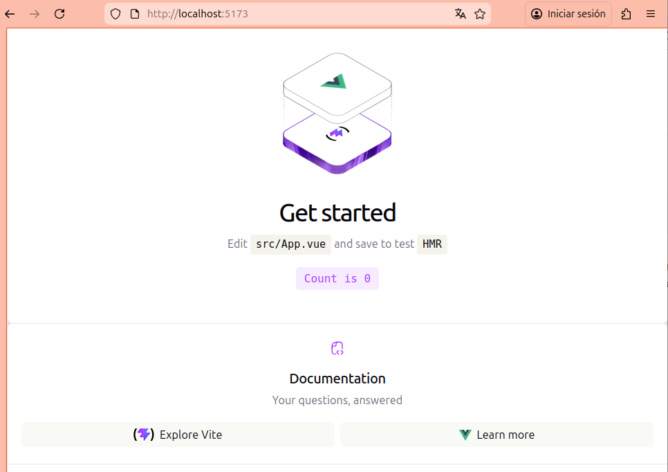

# Componentes

El objetivo de esta práctica es crear un proyecto `VueJS` que nos mostrará la interfaz gráfica básica de nuestra aplicación.

## Repositorio de la práctica

El *repositorio base* de la práctica está disponible en: https://github.com/elisanoguera/practica_dwec_eventos.git

En esta primera práctica se deberá realizar un /fork/ del repositorio base. Al realizar dicho /fork/, se creará un repositorio copia del original en tu cuenta de usuario. *Será sobre este repositorio personal sobre el que deberás trabajar*.

Dicho repositorio personal se utilizará para sucesivas prácticas. La profesora irá añadiendo nuevas tareas cada semana. En cada nueva práctica se darán las instrucciones de cómo proceder para incorporar las nuevas tareas a realizar.

## Requisitos de software

Para trabajar con `VueJS` (en desarrollo), es imprescindible tener instalado `Node.js`, que incluye `npm` (`Node Package Manager`).

Requisitos: 
- `Node.js v18` o superior (recomendado: `v20.x`)
- `npm v9` o superior
- Un entorno de desarrollo (recomendado `Visual Studio Code`).

Comprobación (ejecutar en terminal):

```sh
node -v
npm -v
```

## Preparación
1. Instalar los requisitos de software indicados
2. Hacer un /fork/ del repositorio base https://github.com/elisanoguera/practica_dwec_eventos.git en tu cuenta de GitHub
3. Abrir un terminal
4. Clonar *tu repositorio* (el que se ha creado en tu cuenta al hacer el /fork/, no el repositorio base) al equipo local mediante `git clone`
5. Acceder a la carpeta del repositorio

## Creación de un proyecto con Vite

Para crear un proyecto `VueJS` emplearemos `Vite`, es la herramienta recomendada para proyectos `Vue 3` por su rapidez y
simplicidad. Se trata de un `build tool` moderno que reemplaza a herramientas más lentas como `Webpack`. Para crear un proyecto:

1. Abre el terminal y ejecuta:

```sh
npm create vite@latest [nombre-proyecto-vue]
```

2. Confirma el nombre del proyecto: `(nombre-proyecto-vue)`
   
3. Selecciona el framework: `Vue`
   
4. Selecciona el lenguaje: `JavaScript`
   
5. Selecciona `No`, cuando pregunta si se intala `npm` y empezar ahora. Lo realizaremos a continuación.

6. Finalmente, recuerda que debes ejecutar:

```sh
cd nombre-proyecto-vue
npm install
npm run dev
```

7. Ahora podemos abrir la carpeta del proyecto en `VS Code` y probar su funcionamiento en el navegador. Deberíamos ver algo así:



8. Un proyecto creado con `Vite` tiene la siguiente estructura (básica):

```text
nombre-proyecto-vue/
├── public/            # Archivos estáticos (imágenes, etc.)
├── src/               # Código fuente de la aplicación
│   ├── assets/        # Recursos (imágenes o estilos)
│   ├── components/    # Componentes reutilizables
│   ├── App.vue        # Componente raíz
│   ├── style.css      # Estilos CSS
│   └── main.js        # Punto de entrada de la aplicación
├── index.html         # Archivo HTML principal
├── README.md          # Archivo documentación markdown
├── package.json       # Dependencias y scripts
└── vite.config.js     # Configuración de Vite   
```

## Tareas a realizar


## Formato de la entrega
- Cada persona trabajará en su *repositorio personal* que habrá creado tras realizar el /fork/ del repositorio base.
- Todos los archivos de la práctica se guardarán en el repositorio y se subirán a GitHub periódicamente. Es conveniente ir subiendo los cambios aunque no sean definitivos. *No se admitirán entregas de tareas que tengan un solo commit*.
- *Como mínimo* se debe realizar *un commit* por *cada elemento de la lista de tareas* a realizar (si es que estas exigen crear código, claro está).
- Para cualquier tipo de *duda o consulta* se pueden abrir `Issues` haciendo referencia a la profesora mediante el texto `@elisanoguera` dentro del texto del `Issue`. Los `issues` deben crearse en *tu repositorio*: si no se muestra la pestaña de `Issues` puedes activarla en los `Settings` de tu repositorio.
- Una vez *finalizada* la tarea se debe realizar una `Pull Request` al repositorio base indicando tu *nombre y apellidos* en el mensaje.

