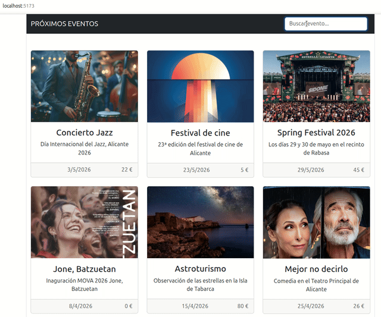

# Filtrar eventos

El objetivo de esta práctica es introducir una barra de búsqueda en nuestro proyecto `VueJS` que nos permitirá visualizar los eventos que cumplan con un filtro determinado.

## Repositorio de la práctica

El **repositorio base** de la práctica está disponible en: https://github.com/elisanoguera/practica_dwec_eventos.git

En esta **segunda práctica** se debe configurar el **repositorio personal** (el que se creó haciendo un *fork* del repositorio base) para añadir un **segundo repositorio remoto**. De esta manera, tu repositorio tendrá dos remotos:

- El remoto **principal**, llamado `origin`, que estará conectado con tu repositorio de tu cuenta de *GitHub*. Es el que utilizarás normalmente para subir periódicamente los cambios (mediante `git push`) o para actualizarlo o clonarlo en otro equipo.

- Un remoto **secundario**, llamado `profesora`, que será de **solo lectura**. Estará conectado con el **repositorio base** y solo se utilizará para incorporar a tu repositorio personal los **enunciados y archivos base** de las siguientes prácticas que vayamos realizando.

En el apartado de **Preparación** se indica cómo proceder para realizar estas tareas.

Recuerda que en todo momento estarás usando el **mismo repositorio**. Lo único que harás será incorporar nuevos cambios con los archivos de las siguientes prácticas.

## Requisitos de software

Para trabajar con `VueJS` (en desarrollo), es imprescindible tener instalado `Node.js`, que incluye `npm` (`Node Package Manager`).

Requisitos: 
- `Node.js v18` o superior (recomendado: `v20.x`)
- `npm v9` o superior
- Un entorno de desarrollo (recomendado `Visual Studio Code`).

Comprobación (ejecutar en terminal):

```sh
node -v
npm -v
```

## Preparación
1. Instalar los requisitos de software indicados
2. Abrir un terminal
3. Situarse en la carpeta del repositorio personal de la práctica
4. **Añadir el remoto secundario** a tu repositorio personal. Para ello hay que ejecutar el comando:
   ```sh
     git remote add profesora https://github.com/elisanoguera/practica_dwec_eventos.git
   ```
5. **Incorporar a tu repositorio personal los cambios** realizados por la profesora correspondientes a los archivos de esta práctica. Para ello hay que ejecutar:
   ```sh
     git pull profesora main
   ```
6. Este comando **descarga** los cambios que ha realizado la **profesora** en el **repositorio base** y los **integra** en tu repositorio personal. Tras realizar este paso, seguramente *git* **abra el editor configurado por defecto** para que introduzcas un **mensaje para crear un nuevo commit** que integre tus cambios y los cambios de la profesora. Debes introducir el texto y guardar los cambios.
7. En principio no deben producirse **conflictos**. En caso de que se produzcan (por ejemplo, porque has editado el fichero `.gitignore` y yo también porque lo exigía la práctica), **resuélvelos y notifícamelo a través de un Issue**.
8. Ejecuta el comando `git push` para subir los cambios a tu repositorio personal (el remoto principal) en *GitHub* y que queden guardados ahí también.
9. Ejecutar el comando `npm install`. Este comando instalará todas las librerías de *Node* necesarias para ejecutar la aplicación. Dichas librerías se guardarán en una carpeta con nombre `node_modules` dentro del repositorio. Nótese que dicha carpeta está excluida del repositorio en el archivo `.gitignore`.

## Tareas a realizar

En esta práctica introduciremos una barra de búsqueda dentro de nuestro proyecto `VueJS`, que nos permitirá filtrar los eventos por el *título*. A continuación, puede verse un ejemplo de funcionamiento:



A continuación, se explica qué modificaciones debemos realizar en nuestro proyecto.

### Componente `BarraBusqueda`

El componente `BarraBusqueda` se encargará de mostrar la barra de búsqueda que nos permitirá filtrar los eventos. Crea un nuevo fichero llamado `BarraBusqueda.vue` en el directorio `components` que contenga lo siguiente:

- Plantilla
    - Utiliza el siguiente código `HTML` en la plantilla:

     ```html
      <form class="d-flex mb-0">
        <input class="form-control me-2" type="text" name="search" placeholder="Buscar evento..." aria-label="Search">
      </form>
     ```

- Variables de datos    
  - `filtro` - Variable reactiva con valor inicial `''`. Como almacenará un tipo de datos primitivo (`String`), es recomendable utilizar `ref()`. Recuerda que `reactive()` se utiliza para `arrays` y `objetos`.
  - `emit` - Constante utilizada para definir un evento personalizado llamado `filtro`. Recuerda que, para definir el evento utilizaremos `defineEmits`. Este evento nos permitirá enviar información al componente padre (`App`). En este caso, le enviaremos el contenido almacenado en la variable `filtro`.

- Métodos: 
  - `watchEffect` - Emite el evento personalizado `filtro` con el contenido de input `search`, que estará almacenado en la variable `filtro` gracias a la directiva `v-model` (que se habrá configurado previamente). Recuerda que `watchEffect` se ejecuta automáticamente cada vez que alguna dependencia reactiva que usa en su interior cambia.


### Componente principal `App`

Modifica el fichero `App.vue` con la siguiente información:

- Plantilla
    - Inserta el componente `BarraBusqueda` en el código `HTML` en la plantilla del componente principal:

     ```html
       <div>
          <nav class="navbar navbar-expand-lg navbar-dark bg-dark">
             <div class="container-fluid">
                <a class="navbar-brand" href="#">PRÓXIMOS EVENTOS</a>
                <!-- Componente BarraBusqueda --> 
             </div>
          </nav>

         <!-- Componente MostrarEventos -->

       </div>        
     ```

- Variables de datos    
  - `filtro` - Variable reactiva con valor inicial `''`. Como almacenará un tipo de datos primitivo (`String`), es recomendable utilizar `ref()`. Recuerda que `reactive()` se utiliza para `arrays` y `objetos`.

- Métodos: 
  - `manejarFiltro` - **Función** manejadora de eventos que recibirá la cadena de búsqueda introducida en el componente `BarraBusqueda`. Almacenará el valor de ese parámetro en la variable `filtro`.

### Componente `MostrarEventos`

- Parámetros (props):
  - `filtro` - Añadimos un nuevo parámetro que contendrá la cadena de texto por la que filtraremos el título.

- Variables de datos
  - `eventosFiltrados` - Variable reactiva que utilizaremos para almacenar el array de eventos filtrados. Inicialmente, contendrá todos los eventos.

- Métodos: 
  - `filtrar` - **Función** recibirá la cadena de búsqueda y devolverá el array de eventos que contienen esa cadena en el título.
  - `watchEffect` - Ejecutará la función `filtrar` y el resultado se almacenará en la variable `eventosFiltrados`. Recuerda que `watchEffect` se ejecuta automáticamente cada vez que alguna dependencia reactiva que usa en su interior cambia.


## Formato de la entrega
- Cada persona trabajará en su **repositorio personal** que habrá creado tras realizar el *fork* del repositorio base.
- Todos los archivos de la práctica se guardarán en el repositorio y se subirán a *GitHub* periódicamente. Es conveniente ir subiendo los cambios aunque no sean definitivos. **No se admitirán entregas de tareas que tengan un solo commit**.
- **Como mínimo** se debe realizar **un commit** por **cada elemento de la lista de tareas** a realizar (si es que estas exigen crear código, claro está).
- Para cualquier tipo de **duda o consulta** se pueden abrir `Issues` haciendo referencia a la profesora mediante el texto `@elisanoguera` dentro del texto del `Issue`. Los `issues` deben crearse en **tu repositorio**: si no se muestra la pestaña de `Issues` puedes activarla en los `Settings` de tu repositorio.
- Una vez **finalizada** la tarea se debe realizar una `Pull Request` al repositorio base indicando tu **nombre y apellidos** en el mensaje.
